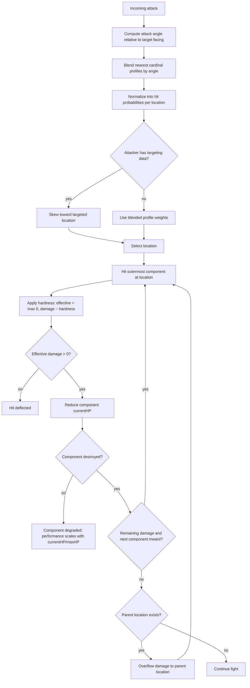

# Unit Data Model

Every entity in the game — mechs, tanks, drones, infantry, even people — uses the same model. A unit is a bag of components mounted to a chassis. The chassis defines the physical structure (locations, slot counts, base weight) but has no stats of its own. Everything a unit can do comes from what's installed. A unit's identity is its loadout and damage history.

A mech is a biped chassis with a cockpit, weapons, and actuators. A tank is a tracked chassis with a turret. A drone is a lightweight chassis with a drone core instead of a cockpit — destroy it and the drone goes offline, no one dies. A person is a chassis with organic locations (head, torso, limbs), no armor, and low maxHP. A rifle is a weapon component on an arm. Body armor is a high-hardness component mounted outermost on the torso. The damage model, budgets, traverse, and profiles are identical across all of them.

---

## Chassis

A chassis is a template that defines a mech's physical structure. It's not a component — it's the skeleton that components bolt onto.

```typescript
interface Chassis {
  id: string;
  name: string;
  manufacturer: string;                 // flavor — who designed this frame
  locations: LocationDef[];             // what body parts this chassis has
  baseWeight: number;                   // empty frame weight (tons)
  maxWeight: number;                    // total weight budget (tons)
}

interface LocationDef {
  id: string;                           // e.g. 'left_arm', 'turret', 'front_left_leg'
  label: string;                        // display name
  slots: number;                        // how many components can mount here
  children?: string[];                  // child location ids (damage can propagate to parent)
  profile: {                            // relative cross-section from each facing
    front: number;                      // weights, not probabilities — normalized at runtime
    rear: number;
    left: number;
    right: number;
  };
  traverse?: {                          // independent rotation relative to parent location
    arc: number;                        // degrees of total traverse (360 = full rotation)
    restAngle: number;                  // default angle relative to parent (0 = forward)
  };
}
```

Chassis examples:
- **Biped:** head, center torso, left/right torso, left/right arm, left/right leg. Leg locations mount biped locomotion components.
- **Quad:** head, center torso, front/rear torso, four legs. Each leg mounts a locomotion component — lose one and speed drops, lose two on the same side and it topples.
- **Tracked:** turret, hull front, hull rear, left/right tread. Tread locations mount tracked locomotion components.

The chassis doesn't define how it moves — the locomotion components mounted at the appropriate locations do. A biped chassis with destroyed leg actuators is a stationary turret. The variable chassis system means new mech designs are data, not code. A mech with an unusual layout (asymmetric arms, extra torso mounts) is just a different `LocationDef[]`.

### Hit profiles

Each location's `profile` defines its relative cross-section from four cardinal facings. These are weights, not probabilities — at hit time, sum the profiles for all locations at the relevant facing and normalize to get hit chance per location.

Example biped profile:

| Location | Front | Rear | Left | Right |
|---|---|---|---|---|
| head | 1 | 1 | 1 | 1 |
| center_torso | 4 | 4 | 0 | 0 |
| left_torso | 2 | 2 | 4 | 0 |
| right_torso | 2 | 2 | 0 | 4 |
| left_arm | 1 | 0 | 3 | 0 |
| right_arm | 1 | 0 | 0 | 3 |
| left_leg | 2 | 2 | 3 | 0 |
| right_leg | 2 | 2 | 0 | 3 |

From the front, center torso dominates. From the left, the left arm/leg/torso absorb most hits while the right side is shielded. The head is always small but always exposed.

For off-angle attacks, blend between the two nearest cardinal profiles. An attack at 30° off the front-left uses `cos(30°) × front + sin(30°) × left` for each location's weight, then normalizes. This gives smooth transitions — an attacker circling a target gradually shifts from hitting the front profile to the side profile with no discrete jumps.

Where the cockpit is mounted determines how exposed the pilot is. A head-mounted cockpit (small profile, always exposed) is a traditional sniper target. A torso-mounted cockpit (larger profile from front, shielded from sides) trades vulnerability for slot space. This is a loadout decision, not a chassis property.

### Location traverse

Locations with a `traverse` field can rotate independently of the mech body. The `arc` defines how far the location can turn (360 = full rotation, 90 = quarter turn), and `restAngle` is its default orientation relative to the parent (0 = forward).

At runtime, each traversable location tracks a `currentAngle`. The actuator component mounted at that location determines how fast it can rotate — the actuator's `turnRate` is degrees per tick. No actuator (or a destroyed one) means the location is frozen at whatever angle it was when the actuator stopped working.

Example traverse values:

| Location | Arc | Rest angle | Notes |
|---|---|---|---|
| turret | 360 | 0 | Full rotation, faces forward at rest |
| left_arm | 90 | -30 | Quarter turn, angled slightly outward at rest |
| right_arm | 90 | 30 | Quarter turn, angled slightly outward at rest |
| head | 180 | 0 | Half rotation, faces forward at rest |

Locations without `traverse` (legs, center torso) are fixed to the chassis and always face the mech's heading.

Weapons don't need their own firing arc — they fire forward relative to their location's current facing. The location's traverse *is* the weapon arc. A weapon on a turret with 360° traverse can hit anything. A weapon on a fixed torso can only fire in the mech's forward direction. A weapon on an arm with a destroyed actuator fires wherever the arm happened to be pointing when the actuator died.

This also affects the hit profile at runtime. A turret rotated 90° left changes which parts of the mech are exposed from a given attack angle — the profile weights shift as locations rotate. The static profile table gives the baseline at rest angles; combat resolution adjusts for current location orientations.

---

## Components

A component has two halves: a template (catalog data, shared and immutable) and an instance (per-unit state). The template defines what a component *is* — a "Medium Laser" is the same medium laser everywhere. The instance tracks the condition of one specific medium laser bolted to one specific mech.

### Component template

Every component occupies slots at a location and contributes to one or more of the four shared budgets. Type-specific stats live directly on the template — no separate stats object.

```typescript
type ComponentType =
  | 'weapon'
  | 'armor'
  | 'reactor'
  | 'heatsink'
  | 'actuator'
  | 'locomotion'
  | 'sensor'
  | 'ecm'
  | 'ammo'                              // universal ammo storage — single shared pool per mech
  | 'cockpit'                           // pilot compartment — destruction kills the pilot
  | 'structure';                        // internal skeleton, gyro, etc.

interface ComponentTemplate {
  id: string;
  name: string;
  type: ComponentType;
  slots: number;                        // how many slots this takes at its location
  weight: number;                       // tons
  powerDraw: number;                    // power consumed when active. Negative = generation (reactors).
  heatGen: number;                      // heat produced per tick when active. Negative = dissipation (heat sinks).
  maxHP: number;                        // raw damage to go from condition 1.0 to 0. Armor: high. Sensor: low.
  hardness: number;                     // flat damage reduction per hit. effectiveDamage = max(0, incoming - hardness)

  // Weapons
  damage?: number;
  range?: number;
  rateOfFire?: number;                  // rounds per tick (ammo-fed weapons)
  ammoPerShot?: number;                 // ammo consumed per shot (draws from shared pool)
  charges?: number;                     // max uses before repair (expendable weapons: missiles, drones)
  minRange?: number;

  // Actuators
  moveSpeed?: number;                   // contribution to mech movement speed (leg actuators)
  turnRate?: number;                    // degrees per tick — controls location traverse speed

  // Locomotion
  locomotionType?: 'biped' | 'quad' | 'tracked' | 'hover';
  topSpeed?: number;                    // max speed contribution
  terrainHandling?: number;             // 0–1, how well it handles rough terrain

  // Sensors
  sensorRange?: number;                 // detection radius
  sensorDetail?: number;               // how much info at what range

  // ECM
  ecmRadius?: number;                   // jamming radius
  ecmStrength?: number;

  // Ammo
  ammoCapacity?: number;                // how much ammo this component stores
}
```

Weapons fall into three categories based on which fields are set: ammo-fed (`ammoPerShot` — continuous fire, draws from shared pool), expendable (`charges` — missiles, drones, restocked on repair), and directed energy (neither — gated by power draw and heat generation alone).

### Component instance

Per-unit state for one installed component. References a template by id.

```typescript
interface ComponentInstance {
  templateId: string;                   // references a ComponentTemplate
  currentHP: number;                    // current hit points — damage reduces this
  maxHP: number;                        // instance ceiling — starts at template.maxHP, ratchets down with crude repairs
  currentCharges?: number;              // remaining uses (expendable weapons only)
}
```

Performance scales with `currentHP / maxHP`. A weapon at half HP has half its rate of fire. An actuator at 70% HP gives 70% of its speed contribution. A component at 0 HP is destroyed.

### Durability: maxHP and hardness

`maxHP` on the template defines a component's baseline durability. The instance starts with `maxHP` equal to the template value. When a component takes a hit: `effectiveDamage = max(0, incomingDamage - hardness)`, then `currentHP -= effectiveDamage`. This is uniform across all component types — damage resolution doesn't need to know what it's hitting.

`hardness` is flat damage reduction per hit. Heavy armor has high hardness — small-caliber rapid fire plinks off without effect. A sensor or cockpit has near-zero hardness — any penetrating hit does full damage. This makes weapon caliber matter: a machine gun that shreds exposed internals is useless against hardened plate, while a single heavy cannon shot punches through.

Armor components are just high-maxHP, high-hardness components mounted on the outside of a location. They don't have special mechanics — they're tough things that take hits first because of where they sit in the stack. Any component can absorb damage for the components behind it; armor is just purpose-built for it.

### Repair grades

A crude repair (using metal) restores `currentHP` but lowers the instance's `maxHP` slightly — the weld holds, but it's not as good as original. Over multiple crude repairs, `maxHP` ratchets down. A precision repair (using precision components) restores both `currentHP` and `maxHP` to the template's original value.

This means a mech that's been field-repaired repeatedly is measurably worse than one maintained with proper parts, even when "fully repaired." The player can feel the difference.

---

## Mech (assembled)

A mech is a chassis plus installed components, with aggregate stats computed from the sum.

```typescript
interface Mech {
  id: string;
  name: string;                         // player-assigned
  chassis: Chassis;
  components: MountedComponent[];       // all installed components, ordered outermost-first per location
  pilot: string | null;                 // pilot id

  // Computed aggregates (recalculated on loadout change)
  totalWeight: number;
  maxWeight: number;                    // from chassis
  netPower: number;                     // sum of all powerDraw. Negative = surplus. Positive = deficit.
  netHeat: number;                      // sum of all heatGen at full load. Negative = runs cool. Positive = builds heat.
  currentHeat: number;                  // runtime state
  moveSpeed: number;                    // from actuators + locomotion + weight
  sensorRange: number;                  // from best sensor
}

interface MountedComponent {
  instance: ComponentInstance;
  location: string;                     // location id on the chassis
}
```

### Weight budget

`totalWeight` must stay under `maxWeight`. Heavier mechs move slower (moveSpeed is penalized by weight/maxWeight ratio), consume more fuel per distance traveled, and put more stress on actuators.

### Power budget

`netPower` is the sum of all `powerDraw` values. Reactors contribute negative values (generation), active systems contribute positive values (consumption). If `netPower` is positive at full load, the pilot has to manage what's powered — running weapons and ECM simultaneously might not be possible. Damaged reactors produce less power (their negative `powerDraw` shrinks toward zero), forcing hard choices mid-fight.

### Heat budget

`netHeat` is the sum of all `heatGen` values at full load. Heat sinks contribute negative values (dissipation), weapons and reactors contribute positive values. When `currentHeat` climbs, systems start shutting down or degrading — rate of fire drops, movement slows, sensors flicker. Sustained fire in the thin Martian atmosphere (less convective cooling) builds heat faster than on Earth. A mech with `netHeat` below zero runs cool indefinitely at full load. One above zero can only sustain full output in bursts.

---

## Damage model

Attacks target a location on the mech. Damage propagates inward through armor layers, then hits internal components.

### Hit resolution

```
1. Compute attack angle relative to target facing
2. Blend between the two nearest cardinal profiles (cosine interpolation)
3. Normalize blended weights into hit probabilities per location
4. Roll hit location (weighted random, skewed by attacker skill/sensors toward targeted location)
5. Hit the outermost component at that location
6. Apply hardness: effectiveDamage = max(0, damage - component.hardness)
7. Reduce component currentHP by effectiveDamage
8. If component destroyed (currentHP <= 0), carry remaining damage to next component inward
9. Repeat until damage is absorbed or all components at location are destroyed
10. If a component is destroyed, check for secondary effects
```

### Hit resolution flowchart



### Emergent outcomes

There are no special-cased secondary effects or salvage rules. Consequences emerge from the component model: a reactor at 0 HP produces no power, so everything shuts down. An ammo container at 0 HP is a ruptured box of explosives — the simulation handles the blast. A cockpit at 0 HP means the pilot is dead. A destroyed mech is just its component stack with whatever HP values survived — salvage is reading the wreckage as-is.

---

## Economy integration

Mechs connect to the commodity model:

- **Crude repairs** consume **metal**. Restore currentHP, lower instance maxHP.
- **Precision repairs** consume **precision components**. Restore currentHP and maxHP to template values.
- **New components** are either purchased (expensive, requires a settlement with stock), salvaged (free but damaged), or fabricated (requires fabstock + fabrication infrastructure).
- **Fuel** consumed proportional to mech weight × distance traveled.
- **Ammo** is a single universal commodity. All ammo-fed weapons draw from the same pool. Resupply at settlements or from inventory.
- **Repair** also restocks expendable weapons (missiles, drones) — these aren't field-reloadable, they're replenished during maintenance.

The two-tier economy tension applies directly: crude metal keeps your mechs running, precision components keep them competitive. A company that burns through its precision stock on mech repairs has fewer to trade or sell, and eventually fields a force of patched-together machines that run hot and hit soft.
